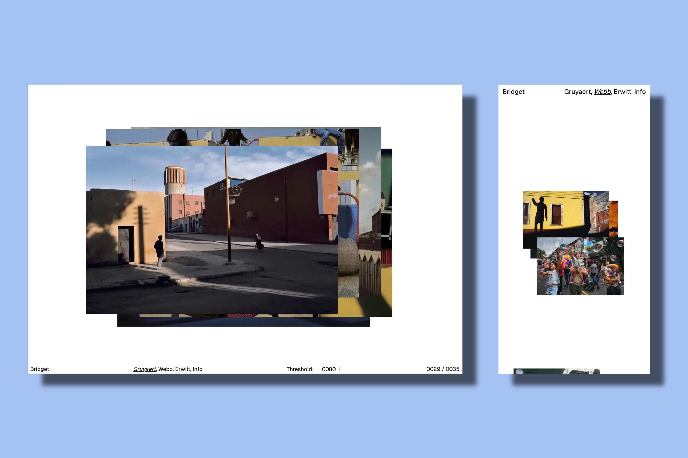

# Bridget

 

Bridget is a minimal [Hugo](https://gohugo.io) theme designed for photographers / visual artists.

It’s based on the https://github.com/tylermcrobert/bridget-pictures-www.

## [Demo Site](https://bridget-demo.sped0nwen.com)

To see this theme in action, here is a live [demo site](https://bridget-demo.sped0nwen.com) which is rendered with **Bridget** theme.

## Getting Started

Head to this [documentation](https://github.com/Sped0n/bridget/blob/main/doc/getStarted.md) for a complete guidance to get started with the Bridget theme.

## Features

- **Blazingly fast**: 99/100 on mobile and 100/100 on desktop in [Google PageSpeed Insights](https://developers.google.com/speed/pagespeed/insights)

- JS **dynamic loading** (powered by ES6 syntax)
- JS **code splitting** by [rollup.js](https://rollupjs.org)
- Image **Preloading**/**Lazy loading**
- **Dynamic resolution** based on view mode
- Multiple **analytics** services supported
- Search engine **verification** supported (Google, Bind, Yandex and Baidu)

## Multilingual and i18n

Bridget supports the following languages:

- English
- Simplified Chinese
- Traditional Chinese
- Japanese
- Korean
- Deutsch
- Spanish
- Italian
- [Contribute with a new language](https://github.com/Sped0n/bridget/pulls)

## Credits

- https://github.com/tylermcrobert/bridget-pictures-www
- https://www.youtube.com/watch?v=Jt3A2lNN2aE
- https://github.com/d4cho/bridget-pictures-clone
