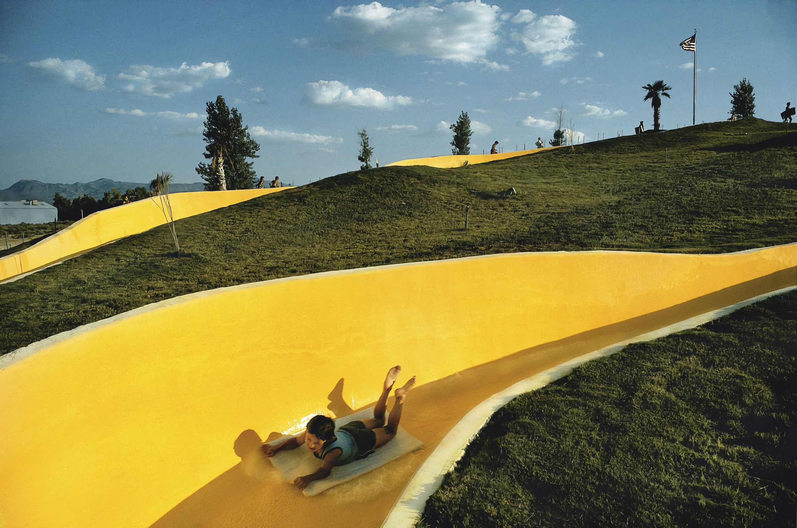
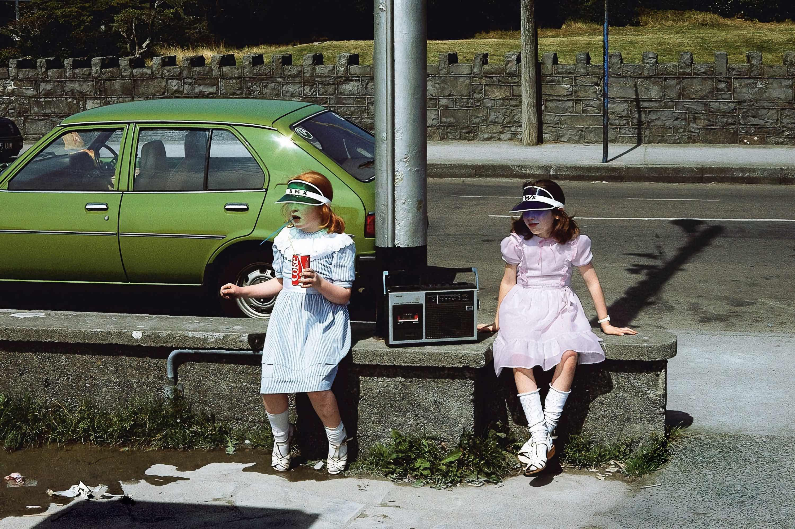
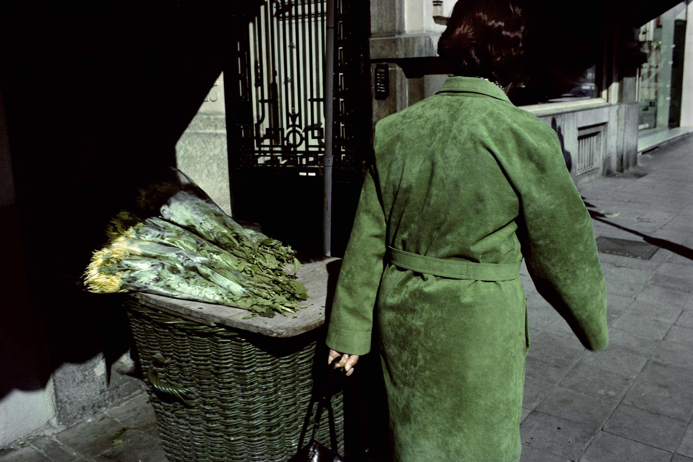

Grey days are underrated. The colour that survives them is the colour that means
it — a red door, a blue tarp, a yellow coat cutting through the murk.

I walked the same three streets for hours, waiting for a figure to complete each
frame. Patience is most of the craft.




