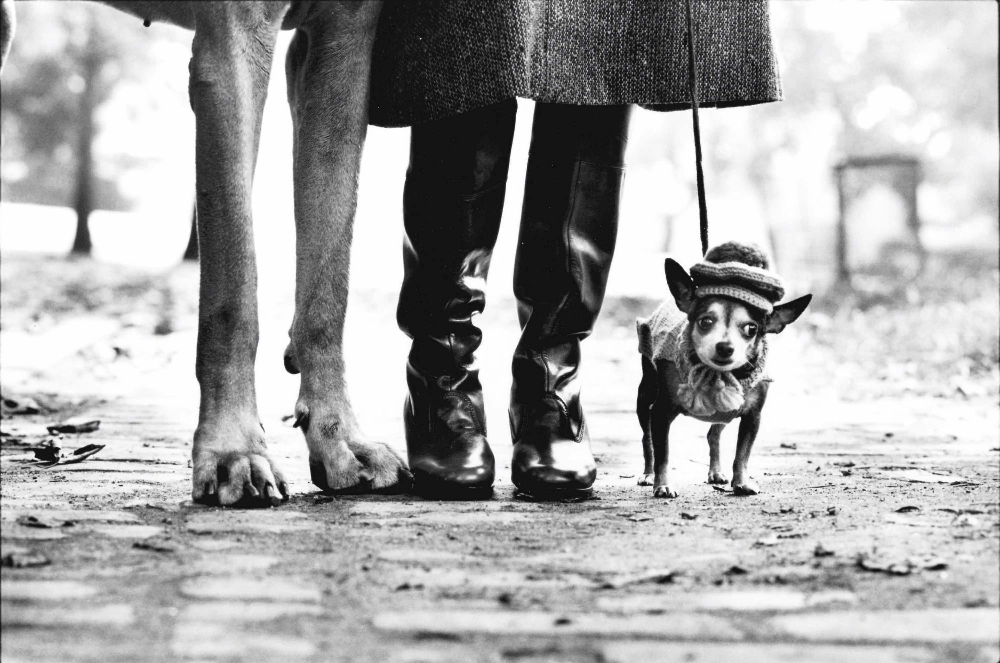
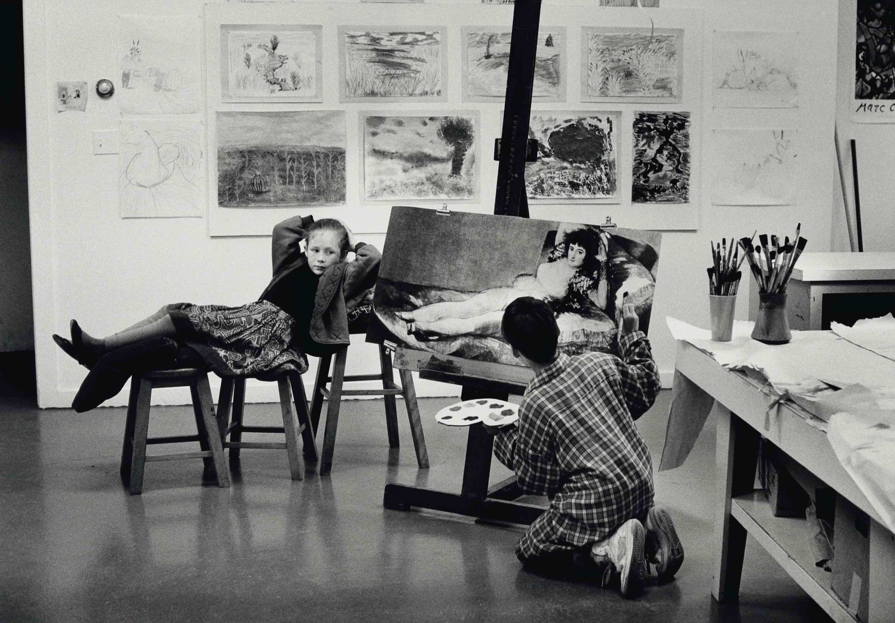
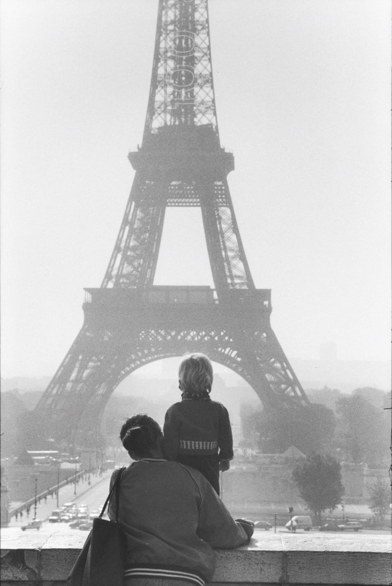

The best low angles come from not caring how you look getting them. Crouch, wait,
let the leash lines draw themselves across the frame.

Nobody minds a photographer at ankle height. You become furniture, and the street
carries on being itself.




