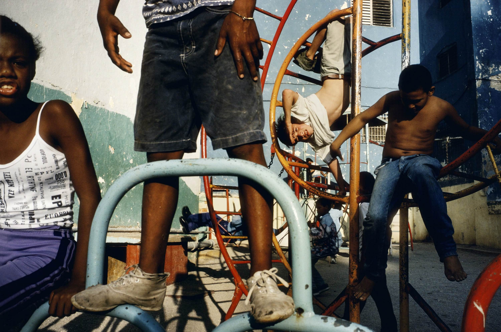
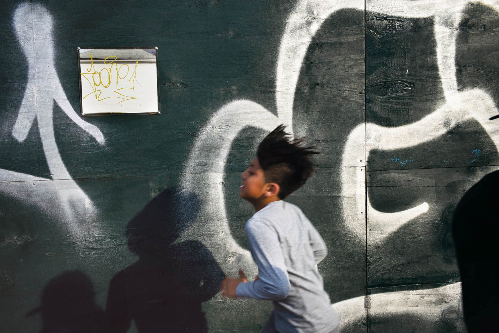
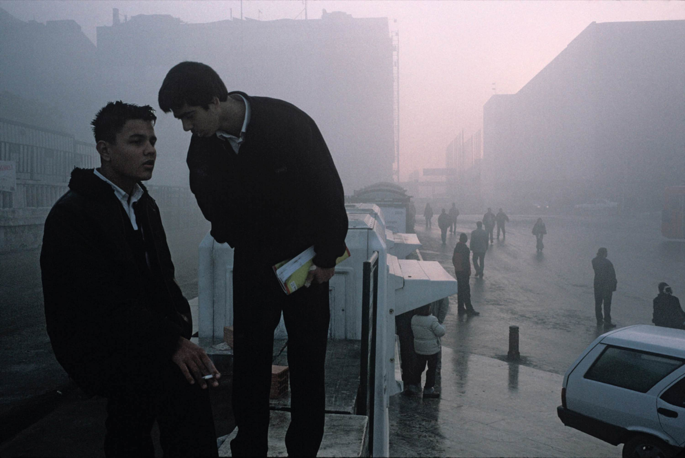
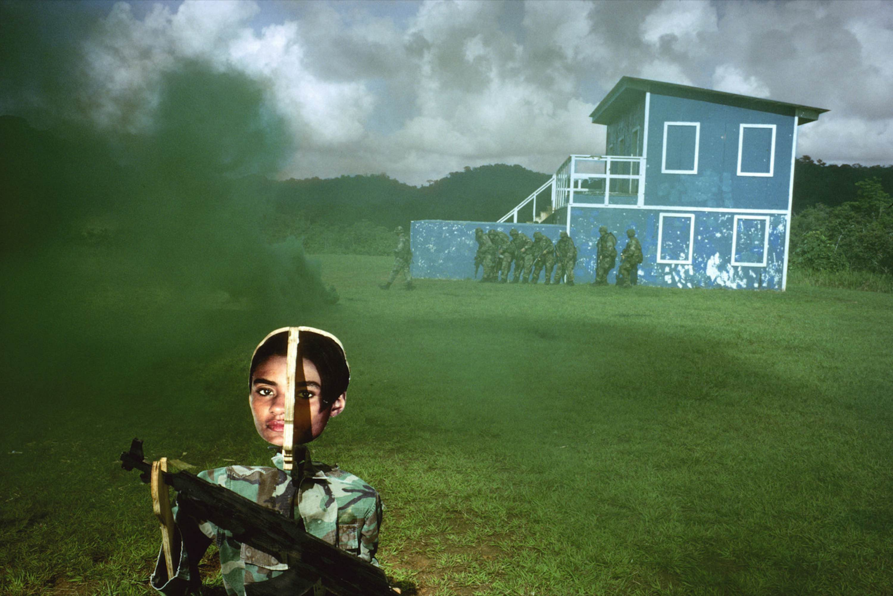
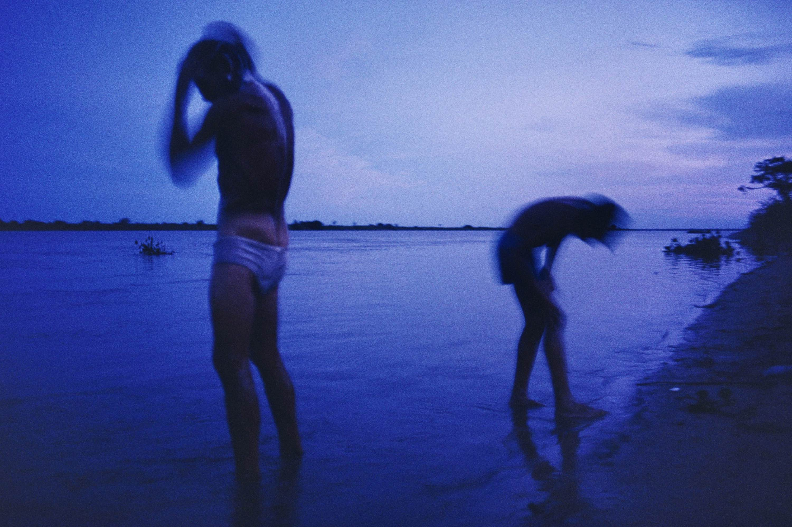
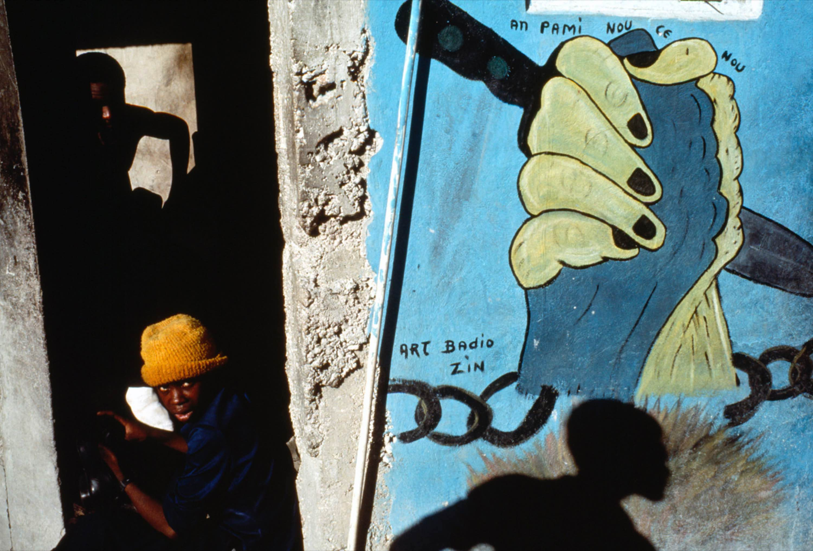

The city hands you contrast before you've had coffee. Hard sun on one side of the
street, deep shade on the other, and people moving between the two all day long.
You don't chase the subject so much as wait for it to cross the line.

I kept the camera low and let colour do the work. There is no accent to add here —
the walls supply it, block after block, in tones no swatch book would dare.





## Waiting for the line

Every good frame was a matter of standing still long enough. The trick was to find
the edge where light met shade, frame it loosely, and let someone walk into it.

> Photography is the only language that can be understood anywhere in the world.

By the last afternoon I'd stopped composing entirely and started collecting — small
rectangles of a city that seems built, more than anywhere I've been, out of pure
colour and the time of day.




